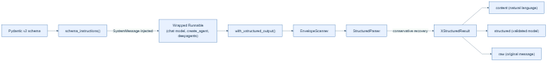

# Architecture overview

## How it fits into an application

`with_xstructured_output(runnable, schema)` sits between a LangChain Runnable
and your application. You provide the Pydantic model that describes the data
you need; the wrapped Runnable produces its normal response; xstructured
returns the natural-language content and validated object together.

The public behavior is intentionally small:

1. Schema instructions are supplied to the model when the input shape allows
   it.
2. The response is separated into prose and structured JSON.
3. The JSON is validated against your Pydantic model.
4. The result preserves the original response and useful metadata.

## Request lifecycle

For invocation, the wrapped Runnable is called with the user's input. The
response is separated into prose and a structured block, then validated
against the supplied Pydantic model. The returned `XStructuredResult` contains
the text, validated object, original response, and metadata.

For streaming, the same protocol is interpreted incrementally. Text and
structured events are emitted in order, followed by a final result event.
This lets applications render a response while retaining a validated object
for downstream work.

See [Concepts](../concepts/index.md) for protocol behavior, validation,
streaming, recovery, and security guidance.
