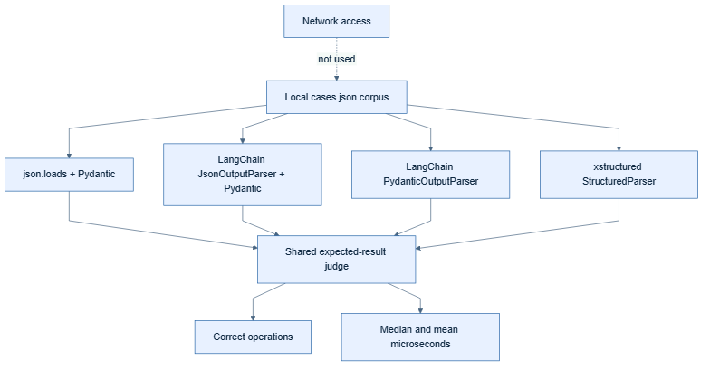

# Benchmarks



The project includes a runnable, deterministic parser experiment comparing:

1. `json.loads` followed by Pydantic validation;
2. LangChain `JsonOutputParser` followed by the same Pydantic validation;
3. LangChain `PydanticOutputParser`; and
4. `xstructured.StructuredParser`.

All mechanisms use the same strict schema and bundled local corpus. Cases cover
exact JSON, fences, prose, envelopes, schema errors, malformed or truncated
JSON, and ambiguous multiple payloads. Correctness is measured against explicit
expected outcomes before latency is summarized.

## Run it

```bash
uv run python -m benchmarks --help
uv run python -m benchmarks
uv run python -m benchmarks --iterations 100 --format json
uv run python -m benchmarks --list-cases
uv run python -m benchmarks --case surrounding-prose
```

The benchmark does not instantiate a model client and makes no network calls.
Each timed operation includes parsing and schema validation. Results are local
measurements, not universal rankings: record the command, Python version,
dependency versions, hardware, power mode, and operating system when publishing
them.

Correctness percentages matter alongside latency. In particular, accepting
truncated or ambiguous JSON is counted as incorrect even when a parser can
produce a value from it.
