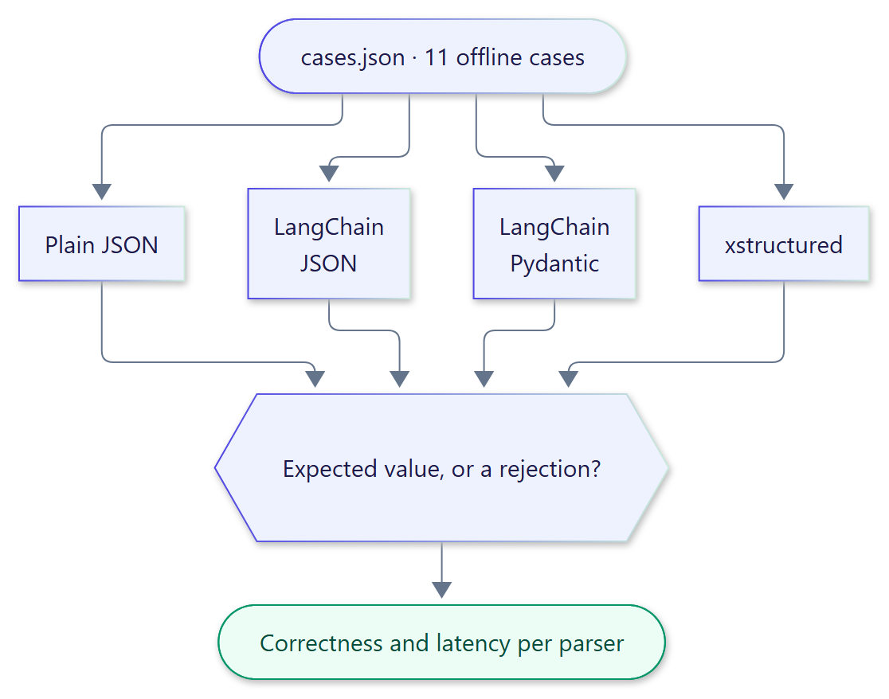

# Benchmarks

The repository includes an offline, reproducible benchmark that runs the same corpus of
model-style outputs through four parsers and checks each answer against an explicit
expectation: the correct value, or a rejection.

{ .diagram width="558" }

Mechanisms compared:

1. **Plain JSON**: `json.loads` followed by Pydantic validation;
2. **LangChain JSON**: LangChain's `JsonOutputParser` followed by the same validation;
3. **LangChain Pydantic**: LangChain's `PydanticOutputParser`;
4. **xstructured**: `StructuredParser` with the default envelope.

## Results

| Mechanism | Correct | Correct % | Median (&micro;s) | Mean (&micro;s) |
| --- | ---: | ---: | ---: | ---: |
| Plain JSON | 5000/11000 | 45.45 | 3.50 | 3.76 |
| LangChain JSON | 5000/11000 | 45.45 | 284.00 | 437.43 |
| LangChain Pydantic | 5000/11000 | 45.45 | 249.65 | 362.31 |
| xstructured | 11000/11000 | 100.00 | 21.00 | 28.45 |

Inputs that must parse:

| Case | Plain JSON | LangChain JSON | LangChain Pydantic | xstructured |
| --- | :---: | :---: | :---: | :---: |
| `valid-json` | :white_check_mark: | :white_check_mark: | :white_check_mark: | :white_check_mark: |
| `markdown-fence` | :x: | :white_check_mark: | :white_check_mark: | :white_check_mark: |
| `fence-inside-prose` | :x: | :white_check_mark: | :white_check_mark: | :white_check_mark: |
| `surrounding-prose` | :x: | :x: | :x: | :white_check_mark: |
| `xstructured-envelope` | :x: | :x: | :x: | :white_check_mark: |
| `delimiter-inside-string` | :x: | :x: | :x: | :white_check_mark: |

Inputs that must be rejected:

| Case | Plain JSON | LangChain JSON | LangChain Pydantic | xstructured |
| --- | :---: | :---: | :---: | :---: |
| `schema-invalid` | :white_check_mark: | :white_check_mark: | :white_check_mark: | :white_check_mark: |
| `duplicate-keys` | :x: | :x: | :x: | :white_check_mark: |
| `trailing-comma` | :white_check_mark: | :white_check_mark: | :white_check_mark: | :white_check_mark: |
| `truncated-json` | :white_check_mark: | :x: | :x: | :white_check_mark: |
| `multiple-bare-payloads` | :white_check_mark: | :x: | :x: | :white_check_mark: |

Measured with 1000 iterations per case on Python 3.14.7 (Windows AMD64), xstructured
0.1.0, langchain-core 1.6.6, and pydantic 2.13.5. Correctness is deterministic; latency
varies between runs and machines, while the ordering stays the same.

Accepting ambiguous or truncated JSON counts as **incorrect**, even when a parser returns a
value: a truncated response accepted as complete, or two payloads silently merged into
one, is a correctness bug in production.

## Run it yourself

```bash
uv run python -m benchmarks                    # aligned table
uv run python -m benchmarks --format markdown  # the tables on this page
uv run python -m benchmarks --format json      # machine-readable
uv run python -m benchmarks --list-cases
uv run python -m benchmarks --case surrounding-prose --iterations 100
```

The benchmark makes no network calls and needs no credentials. Results are local
measurements, not universal rankings: when you publish numbers, include the command,
Python version, dependency versions, hardware, and operating system, as above. To add a
case, append it to `benchmarks/cases.json` with its expected value, or `null` when it
must be rejected.
