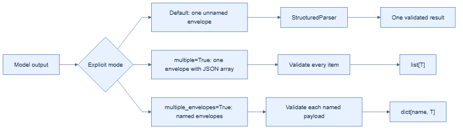

# Multiple payloads



`xstructured` supports multiple structured values as a JSON array inside one
envelope. Enable it explicitly with `multiple=True`; the default remains one
validated value per response.

```python
from xstructured import with_xstructured_output

chain = with_xstructured_output(model, Finding, multiple=True)
result = chain.invoke("List every finding in this report.")
assert all(isinstance(item, Finding) for item in result.structured)
```

The complete array is validated item by item. Named schemas are also supported:
each array item can use the configured `{"schema": "...", "payload": ...}`
discriminator shape, allowing heterogeneous result lists.

Multiple complete envelopes are not concatenated into one result. If a trusted
transport deliberately frames independent messages, invoke one parser per
frame. Do not concatenate bare JSON documents and rely on recovery.

## Separately named envelopes

For a response containing different payloads with different schemas, enable
`multiple_envelopes=True`:

```python
chain = with_xstructured_output(
    model,
    schema={"finding": Finding, "recommendation": Recommendation},
    multiple_envelopes=True,
)
```

The model response is:

```text
Analysis:
<xstructured name="finding">
{"title": "Checkout regression", "severity": "high"}
</xstructured>
Recommendation:
<xstructured name="recommendation">
{"owner": "platform", "action": "Add a canary check"}
</xstructured>
```

The validated result is a dictionary:

```python
result.structured["finding"]
result.structured["recommendation"]
```

This is an advanced opt-in mode. A single-schema wrapper still expects exactly
one unnamed envelope by default.

Applications that treat a second payload as suspicious should reject it at
their message or transport boundary before parsing. See [Security](../security.md)
for validation and authorization guidance.
