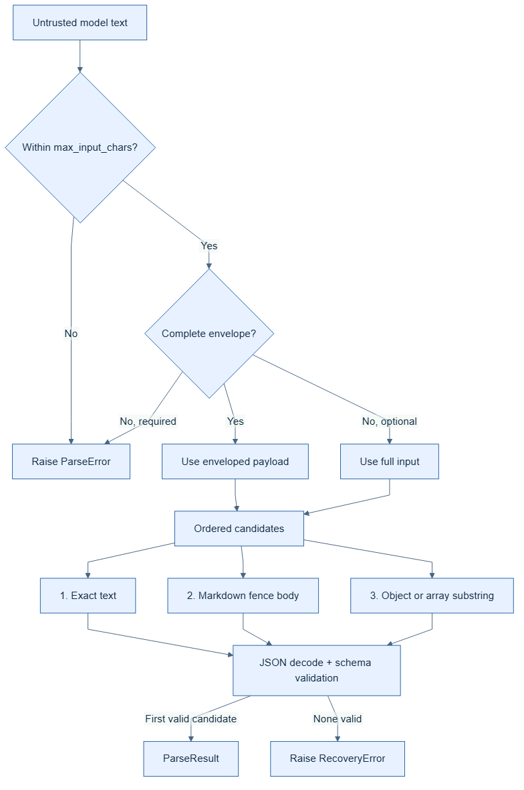

# Repair and recovery



`xstructured` performs **recovery**, not general JSON repair. Recovery changes
which existing substring is parsed; it never inserts quotes, closes brackets,
removes commas, or otherwise invents syntax.

The candidates are deterministic and tried in order: exact text, a complete
Markdown JSON fence, then a surrounding object or array. Every candidate must
both decode as JSON and pass the configured Pydantic schema. The first valid
candidate wins and sets `ParseResult.recovered` when it was not the original
text.

Malformed JSON and schema-invalid values fail with `RecoveryError`. This is an
intentional integrity guarantee: callers can retry the model, request a human
review, or explicitly apply a separate repair policy without confusing an
inferred value with model-produced data.

Recovery can be bounded or disabled:

```python
from xstructured import ParserConfig, RecoveryConfig, StructuredParser

config = ParserConfig(
    max_input_chars=100_000,
    recovery=RecoveryConfig(enabled=True, max_candidates=3),
)
parser = StructuredParser(MySchema, config=config)
```

See [Security](../security.md) for guidance on handling parsed model output.


## Bounded LLM-assisted repair (optional)

Recovery above is deterministic and never calls a model. Some applications
would rather spend one extra, bounded model call to fix output that recovery
could not, instead of failing the whole request. `with_xstructured_output`
supports this as an **explicit opt-in**: pass a `repair` Runnable (any
chat model or callable Runnable) and it is only ever invoked after normal
parsing and recovery have both failed.

```python
from xstructured import RepairConfig, with_xstructured_output

structured = with_xstructured_output(
    model,
    ContactInfo,
    repair=repair_model,  # any Runnable[str | list[BaseMessage], str | BaseMessage]
    repair_config=RepairConfig(max_attempts=2),
)
```

Each attempt sends the repair Runnable a prompt built from the schema (or
named schema) instructions, the validation errors from the failed attempt,
and the invalid text, then re-parses and re-validates the repair Runnable's
response with the same `StructuredParser` used for the original response --
a "repaired" value is held to exactly the same schema as any other result.
If a repair attempt is itself invalid, its errors seed the next attempt's
prompt, up to `RepairConfig.max_attempts` (default `1`). Exhausting the
budget raises `RepairError`, a `ParseError` subclass carrying
`attempt_count` and the `repair_errors` seen along the way.

`RepairConfig(enabled=False)` disables the retry loop without requiring
callers to remove the `repair` Runnable -- useful for toggling repair by
configuration (e.g. per-environment) while keeping the wiring in one place.

Successful repairs are reported on the result: `XStructuredResult.repaired`
(and `ParseResult.repaired`) is `True` only when a repair attempt produced
the final value, so callers and telemetry can distinguish "the model got it
right" from "we had to ask again."

Repair is only available for `invoke`/`ainvoke`; `stream`/`astream` do not
retry, since bounded repair re-sends the complete invalid text and is not a
meaningful operation on a partial, in-progress stream.
