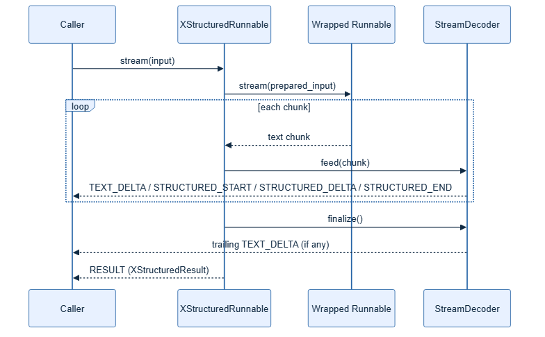

# Streaming



`StreamDecoder` turns a live stream of text chunks into ordered protocol
events, so a caller can render natural-language text and structured data as
they arrive, instead of waiting for the full response:

```python
from xstructured import EnvelopeSpec, StreamDecoder, StructuredParser


class Answer(BaseModel):
    value: int


envelope = EnvelopeSpec()
decoder = StreamDecoder(StructuredParser(Answer, envelope=envelope), envelope)

events = []
for chunk in ("Natural ", "<xstructured>", '{"value": 42}', "</xstructured>", " tail"):
    events.extend(decoder.feed(chunk))
events.extend(decoder.finalize())
```

Event kinds, in the order they are emitted:

| Kind | Meaning |
| --- | --- |
| `TEXT_DELTA` | A chunk of natural-language text outside the envelope. |
| `STRUCTURED_START` | The envelope's opening delimiter was found. |
| `STRUCTURED_DELTA` | A chunk of raw text inside the envelope. |
| `STRUCTURED_END` | The envelope's closing delimiter was found; carries the validated `structured` value. |
| `RESULT` | Emitted once, at the very end, carrying the complete `XStructuredResult`. |

`StreamDecoder` itself only ever emits `TEXT_DELTA` / `STRUCTURED_*` events
(`.feed()` and `.finalize()`). `RESULT` is produced one layer up, by
`with_xstructured_output(...).stream(...)` / `.astream(...)`, once the
underlying `Runnable`'s stream is exhausted and the accumulated text has
been re-validated end to end. Consuming code can safely append `TEXT_DELTA`
text to a transcript as it arrives, while buffering `STRUCTURED_DELTA` text
separately until `STRUCTURED_END` (or `RESULT`) delivers the validated
Pydantic object.