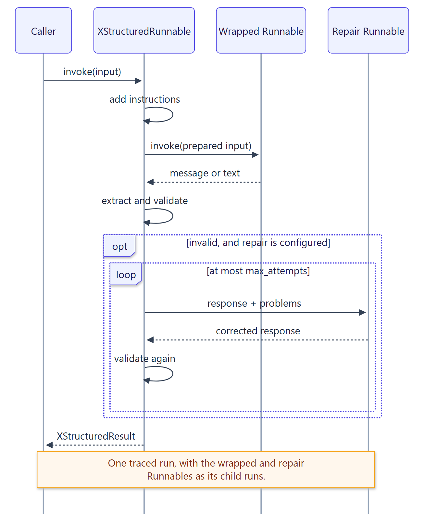

# User guide

`xstructured` is built from small, independently usable layers. The LangChain wrapper
combines all of them, and each is public for use on its own.

| Layer | Public API | Guide |
| --- | --- | --- |
| Envelopes | `EnvelopeSpec`, `EnvelopeScanner` | [Envelopes](envelopes.md) |
| Parsing and recovery | `StructuredParser`, `ParseResult` | [Parsing and recovery](parsing.md) |
| Schemas and instructions | `inspect_schema`, `schema_instructions`, `fingerprint_schema`, named schemas | [Schemas and instructions](schemas.md) |
| Multiple values | `multiple=True`, named schemas, named envelopes | [Multiple payloads](multiple-payloads.md) |
| Streaming | `StreamDecoder`, `StreamEvent`, `StreamEventKind` | [Streaming](streaming.md) |
| Repair | `repair=`, `RepairConfig` | [Bounded repair](repair.md) |
| Limits | `ParserConfig`, `RecoveryConfig` | [Configuration and limits](configuration.md) |
| Errors | `ParseError` and its subclasses | [Error handling](errors.md) |
| Operations | result metadata, tracing | [Observability](observability.md) |

{ .diagram width="653" }

The contract behind every layer is the same:

- **Model output is untrusted.** It is size-limited, decoded strictly, and validated
  before you see it.
- **Nothing is invented.** Recovery picks one of a few substrings of the response; it
  never edits JSON. Repair, when enabled, asks a model for a new response and validates
  it like any other.
- **Failures are explicit and typed.** Every failure raises a `ParseError` subclass that
  keeps the offending text for debugging.
