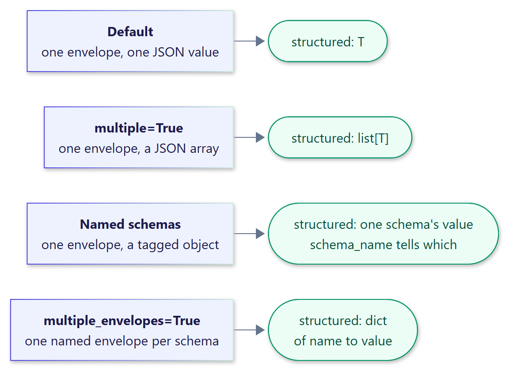

<!-- docs-test: run -->

# Multiple payloads

By default a response carries exactly one validated value. Three opt-in modes cover
responses with more than one.

{ .diagram width="577" }

In the examples on this page, a `RunnableLambda` that returns a canned response stands in
for a chat model.

```python
from typing import Literal

from langchain_core.runnables import RunnableLambda
from pydantic import BaseModel

from xstructured import with_xstructured_output


class Finding(BaseModel):
    title: str
    severity: Literal["low", "medium", "high"]


class Action(BaseModel):
    owner: str
    action: str


def model_replying(text: str) -> RunnableLambda:
    return RunnableLambda(lambda _: text)
```

## A list of values

`multiple=True` asks for a JSON array and validates every item. `structured` is a list.

```python
findings = with_xstructured_output(
    model_replying(
        "Two findings.\n<xstructured>["
        '{"title": "Error spike after release", "severity": "high"},'
        '{"title": "Rollback restored service", "severity": "low"}'
        "]</xstructured>"
    ),
    Finding,
    multiple=True,
)

result = findings.invoke("List the findings.")
assert [finding.severity for finding in result.structured] == ["high", "low"]
```

A failing item is reported with its index, for example `item 1: severity: Input should be
'low', 'medium' or 'high'`.

## Mixed types in one list

Combine `multiple=True` with [named schemas](schemas.md#named-schemas) for heterogeneous
lists. Each item names its schema:

```python
mixed = with_xstructured_output(
    model_replying(
        "<xstructured>["
        '{"schema": "finding", '
        '"payload": {"title": "Error spike", "severity": "high"}},'
        '{"schema": "action", '
        '"payload": {"owner": "platform", "action": "Add a canary"}}'
        "]</xstructured>"
    ),
    {"finding": Finding, "action": Action},
    multiple=True,
)

result = mixed.invoke("Review the incident.")
assert result.structured == [
    Finding(title="Error spike", severity="high"),
    Action(owner="platform", action="Add a canary"),
]
```

## Separately named envelopes

`multiple_envelopes=True` lets the model interleave prose with one envelope per schema
name. `structured` is a dictionary keyed by name, in order of appearance. Each envelope is
recovered and validated independently; an unknown, duplicated, or unclosed envelope is an
error.

```python
named = with_xstructured_output(
    model_replying(
        "Analysis: the spike started with the release.\n"
        '<xstructured name="finding">'
        '{"title": "Release regression", "severity": "high"}'
        "</xstructured>\n"
        "Next step:\n"
        '<xstructured name="action">'
        '{"owner": "payments", "action": "Roll back"}'
        "</xstructured>"
    ),
    {"finding": Finding, "action": Action},
    multiple_envelopes=True,
)

result = named.invoke("Analyze the incident.")
action = Action(owner="payments", action="Roll back")
assert result.structured["action"] == action
assert result.content == (
    "Analysis: the spike started with the release.\n\nNext step:\n"
)
assert result.metadata["envelope_count"] == 2
```

Named envelopes need tag-style delimiters such as the default `<xstructured>`. They can be
streamed inside a composed chain but not with `stream()` directly; see
[Streaming](streaming.md).

## What is never accepted

Separate JSON documents next to each other, such as `{"a": 1} {"a": 2}`, are rejected
rather than merged or truncated to the first one: ambiguity is an error, not a guess.
