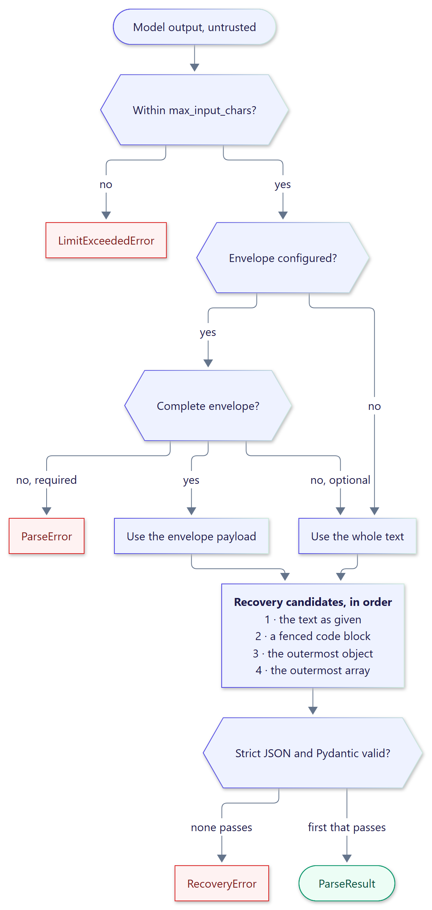

<!-- docs-test: run -->

# Parsing and recovery

`StructuredParser` turns text into a value validated by a Pydantic v2 schema target: a
model class, a `TypeAdapter`, or any type annotation Pydantic understands.

```python
from pydantic import BaseModel

from xstructured import StructuredParser


class Answer(BaseModel):
    value: int


parser = StructuredParser(Answer)
result = parser.parse('{"value": 42}')

assert result.value == Answer(value=42)
assert not result.recovered
```

{ .diagram width="570" }

## Conservative recovery

When the text as given is not valid, the parser tries a fixed, ordered list of
*candidates*. Each one is a substring of the response; JSON syntax is never rewritten
(no quote fixing, no comma removal, no closing of truncated output).

1. The text as given.
2. The body of a Markdown code fence that spans the whole text.
3. The outermost `{...}` substring.
4. The outermost `[...]` substring.

The first candidate that decodes as strict JSON **and** validates wins, and
`ParseResult.recovered` reports whether a candidate other than the text itself was used.

```python
fenced = parser.parse('```json\n{"value": 5}\n```')
chatty = parser.parse('Sure! The answer is {"value": 5}. Anything else?')

assert fenced.value == chatty.value == Answer(value=5)
assert fenced.recovered and chatty.recovered
assert chatty.json_text == '{"value": 5}'
```

When no candidate works, a `RecoveryError` lists one failure per candidate, and its
message highlights the most useful one: a schema violation of otherwise valid JSON.

```python
from xstructured import RecoveryError

try:
    parser.parse('Result: {"value": "forty-two"}')
except RecoveryError as error:
    print(error)
    print(error.failures)
```

```text
No recovery candidate is valid JSON matching the schema (2 tried): value: Input should be a valid integer, unable to parse string as an integer
('Expecting value: line 1 column 1 (char 0)', 'value: Input should be a valid integer, unable to parse string as an integer')
```

Recovery can be tuned or disabled with [`RecoveryConfig`](configuration.md).

## Strict JSON

Before validation, every candidate is decoded with rules that reject ambiguous or unsafe
documents:

- duplicate object keys (`{"a": 1, "a": 2}`);
- the non-standard constants `NaN`, `Infinity`, and `-Infinity`;
- numbers that overflow to an infinite float, such as `1e400`;
- nesting deeper than `ParserConfig.max_nesting_depth`.

## Validation in JSON mode

Validation uses Pydantic's JSON mode, the same mode as `model_validate_json`. Strict models
therefore accept JSON representations of rich types, such as ISO 8601 dates:

```python
from datetime import date

from pydantic import ConfigDict


class Release(BaseModel):
    model_config = ConfigDict(strict=True)

    version: str
    shipped: date


parser = StructuredParser(Release)
release = parser.parse('{"version": "2.1", "shipped": "2026-10-04"}')
assert release.value.shipped == date(2026, 10, 4)
```

## Envelopes

Pass an `EnvelopeSpec` to read the payload from an envelope. Recovery then applies to the
payload inside it. By default a missing envelope falls back to parsing the whole text; set
`ParserConfig(require_envelope=True)` to make it an error.

```python
from xstructured import EnvelopeSpec, ParseError, ParserConfig

lenient = StructuredParser(Answer, envelope=EnvelopeSpec())
strict = StructuredParser(Answer, config=ParserConfig(require_envelope=True))

assert lenient.parse('{"value": 1}').value == Answer(value=1)
result = strict.parse('Done. <xstructured>{"value": 2}</xstructured>')
assert result.envelope_spans == ((6, 45),)

try:
    strict.parse('{"value": 3}')
except ParseError as error:
    # Prints: No complete <xstructured>...</xstructured> envelope was found
    print(error)
```

`strip_envelopes` returns the natural-language part of a response:

```python
text = 'Done. <xstructured>{"value": 2}</xstructured> Bye.'
assert strict.strip_envelopes(text) == "Done.  Bye."
```
