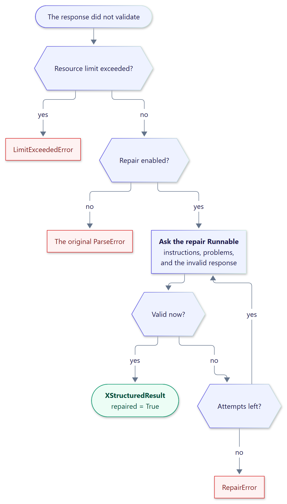

<!-- docs-test: run -->

# Bounded repair

[Recovery](parsing.md#conservative-recovery) never calls a model: it only tries a few
substrings of the response. When a response is genuinely invalid, you can opt in to
*repair*, which sends the response back to a model for correction.

{ .diagram width="609" }

Repair is strictly opt-in and bounded:

- It runs only when you pass a `repair` Runnable, and only after parsing and recovery fail.
- It never runs for `LimitExceededError`: an oversized response is not sent anywhere.
- It makes at most `RepairConfig.max_attempts` calls (default 1, maximum 5).
- Each attempt's output is parsed by the **same** parser, with the same schema and limits.
  Repair can replace an invalid response; it can never relax what counts as valid.

In the examples on this page, `RunnableLambda`s with canned replies stand in for models.

```python
from langchain_core.runnables import RunnableLambda
from pydantic import BaseModel

from xstructured import RepairConfig, with_xstructured_output


class Invoice(BaseModel):
    number: str
    total: float


invalid = (
    "Here it is: <xstructured>{number: 'INV-7', total: 12.5}</xstructured>"
)
fixed = '<xstructured>{"number": "INV-7", "total": 12.5}</xstructured>'
prompts = []


def repair_model(prompt: str) -> str:
    prompts.append(prompt)
    return fixed


wrapper = with_xstructured_output(
    RunnableLambda(lambda _: invalid),
    Invoice,
    repair=RunnableLambda(repair_model),
    repair_config=RepairConfig(max_attempts=2),
)
result = wrapper.invoke("Extract the invoice.")

assert result.structured == Invoice(number="INV-7", total=12.5)
assert result.repaired and result.repair_attempts == 1
# Prose comes from the original response.
assert result.content == "Here it is: "
```

The repair Runnable receives a prompt with the instructions, the problems found, and the
invalid response:

```python
print(prompts[0])
```

```text
The response below could not be used because it does not follow the required format. Rewrite the complete response so that it follows the instructions exactly. Return only the corrected response.

Instructions:
Include exactly one structured block in your response, formatted as:
...

Problems (attempt 1 of 2):
- Expecting property name enclosed in double quotes: line 1 column 2 (char 1)

Response to correct:
Here it is: <xstructured>{number: 'INV-7', total: 12.5}</xstructured>
```

If every attempt fails, `RepairError` reports the attempt count and one failure per
attempt; the last attempt's parse error is its `__cause__`.

```python
from xstructured import RepairError

stubborn = with_xstructured_output(
    RunnableLambda(lambda _: invalid),
    Invoice,
    repair=RunnableLambda(lambda _: "still not valid"),
    repair_config=RepairConfig(max_attempts=2),
)
try:
    stubborn.invoke("Extract the invoice.")
except RepairError as error:
    assert error.attempts == 2
    assert len(error.failures) == 2
```

## Choosing a repair model

Any Runnable that accepts a string works: often the same chat model, sometimes a cheaper
or more capable one. Disable repair per environment with `RepairConfig(enabled=False)`
without changing the wiring.

Repair runs for `invoke`, `ainvoke`, `batch`, `abatch`, and inside composed streaming
chains. It is not attempted while streaming events directly, because the events have
already been delivered. Repair calls appear as child runs tagged `xstructured:repair` in
your traces.
