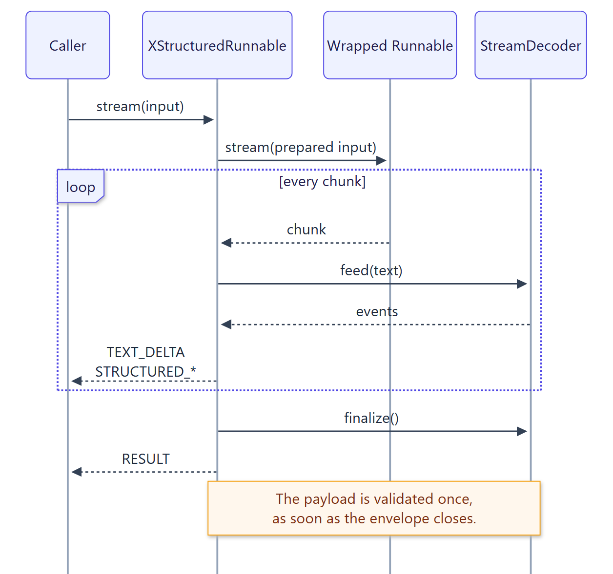

<!-- docs-test: run -->

# Streaming

Calling `stream()` or `astream()` on a wrapped Runnable yields ordered `StreamEvent`
values while the model is still generating. Text can be shown immediately, and the
structured value is validated the moment its envelope closes.

{ .diagram width="628" }

| Event | Meaning | Field |
| --- | --- | --- |
| `TEXT_DELTA` | Natural-language text outside the envelope | `text` |
| `STRUCTURED_START` | The opening delimiter arrived | |
| `STRUCTURED_DELTA` | Raw payload text inside the envelope | `text` |
| `STRUCTURED_END` | The envelope closed and the payload validated | `structured` |
| `RESULT` | The stream ended; emitted exactly once | `result` |

Every event has a zero-based `sequence` number. Concatenating the `TEXT_DELTA` texts gives
`result.content`; concatenating the `STRUCTURED_DELTA` texts gives the raw payload.

## Streaming a chat model

Here LangChain's `GenericFakeChatModel` stands in for a real chat model; like one, it
streams its reply as message chunks.

```python
from langchain_core.language_models.fake_chat_models import GenericFakeChatModel
from langchain_core.messages import AIMessage
from pydantic import BaseModel

from xstructured import StreamEventKind, with_xstructured_output


class StatusUpdate(BaseModel):
    status: str
    next_step: str


reply = (
    "The deploy finished and all checks are green. "
    '<xstructured>{"status": "healthy", "next_step": "Promote to all regions."}'
    "</xstructured>"
)
model = GenericFakeChatModel(messages=iter([AIMessage(content=reply)]))
wrapper = with_xstructured_output(model, StatusUpdate)

for event in wrapper.stream("How did the deploy go?"):
    if event.kind is StreamEventKind.TEXT_DELTA:
        print(event.text, end="")
    elif event.kind is StreamEventKind.STRUCTURED_END:
        print("\ncard:", event.structured)
    elif event.kind is StreamEventKind.RESULT:
        final = event.result

expected = StatusUpdate(status="healthy", next_step="Promote to all regions.")
assert final.structured == expected
assert final.raw.text == reply  # Message chunks are merged into one AIMessage.
```

The final result matches what `invoke` returns, including the merged message's usage
metadata.

## Streaming inside a chain

Inside a composed chain the wrapper behaves like any other Runnable: when the chain is
streamed, it consumes the wrapped Runnable's stream and passes its final
`XStructuredResult` downstream, so every step receives exactly what `invoke` would produce.

```python
from langchain_core.runnables import RunnableLambda

model = GenericFakeChatModel(messages=iter([AIMessage(content=reply)]))
chain = with_xstructured_output(model, StatusUpdate) | RunnableLambda(
    lambda result: result.structured.status
)

assert list(chain.stream("How did the deploy go?")) == ["healthy"]
```

To stream protocol events, call `stream()` on the wrapper itself; wrap the whole chain if
you need a prompt in front of the model. `astream_events()` also surfaces both the
model's token events and the wrapper's protocol events.

## Decoding a stream yourself

`StreamDecoder` implements the protocol for any source of text chunks, for example a
provider SDK or a WebSocket:

```python
from xstructured import StreamDecoder, StructuredParser

decoder = StreamDecoder(StructuredParser(StatusUpdate))
events = []
for chunk in [
    "All good. <xstruc",
    'tured>{"status": "ok", ',
    '"next_step": "none"}</xs',
    "tructured>",
]:
    events.extend(decoder.feed(chunk))
decoder.finalize()

assert decoder.result.value == StatusUpdate(status="ok", next_step="none")
assert decoder.text == "All good. "
assert [event.kind for event in events][-1] is StreamEventKind.STRUCTURED_END
```

`finalize()` raises `ParseError` if the stream ended without a complete envelope, and the
decoder enforces the parser's input, envelope, and payload limits as chunks arrive.

## Limits of streaming

- Streaming requires an envelope; there is no recovery for a missing one.
- Repair is not attempted while streaming events, because events have already been
  delivered. Inside a composed chain, where only the final result is emitted, repair
  works as with `invoke`.
- Named envelopes (`multiple_envelopes=True`) cannot be streamed with `stream()`.
