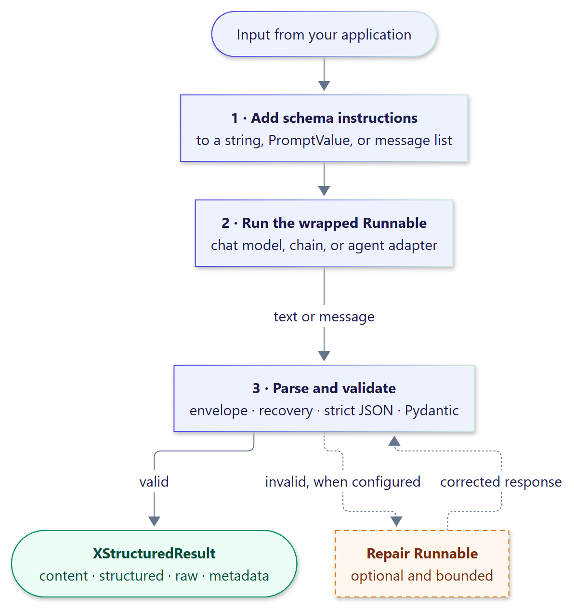

---
hide:
  - navigation
  - toc
---

<div class="xs-hero" markdown>

# xstructured

<p class="xs-tagline">
Validated Pydantic data <strong>and</strong> natural-language text from one LLM response.
Wrap any LangChain v1 Runnable, chat model, or agent; get typed results that survive
Markdown fences, chatty prose, and token-by-token streaming.
</p>

[Get started](getting-started/index.md){ .md-button .md-button--primary }
[Browse examples](examples/index.md){ .md-button }
[API reference](api/index.md){ .md-button }

</div>

## Why xstructured

<div class="grid cards" markdown>

-   :material-shield-check:{ .lg .middle } __Validated, never guessed__

    ---

    Every value passes strict JSON decoding and Pydantic v2 validation in JSON mode.
    Recovery only chooses *which* part of a response to parse; it never rewrites JSON.

-   :material-text-box-check-outline:{ .lg .middle } __Prose and data together__

    ---

    The model answers in its own words and places a JSON payload in an envelope.
    You get both: `result.content` for people and `result.structured` for code.

-   :material-lightning-bolt:{ .lg .middle } __Ordered streaming__

    ---

    Stream text deltas to your UI while the structured payload arrives, then receive the
    validated value the moment its envelope closes.

-   :material-puzzle-outline:{ .lg .middle } __Composes with LangChain__

    ---

    A standard Runnable: `invoke`, `batch`, `stream`, async variants, tracing,
    retries, fallbacks, and composition all behave natively.

-   :material-lock-outline:{ .lg .middle } __Bounded by design__

    ---

    Input, envelope, payload, and nesting limits; duplicate keys, `NaN`, and overflowing
    numbers are rejected before validation.

-   :material-wrench-check-outline:{ .lg .middle } __Optional, bounded repair__

    ---

    When recovery is not enough, an opt-in repair Runnable gets a fixed number of
    attempts, and its output is held to the same schema.

</div>

## Thirty-second tour

=== "pip"

    ```bash
    pip install xstructured
    ```

=== "uv"

    ```bash
    uv add xstructured
    ```

```python
from langchain.chat_models import init_chat_model
from pydantic import BaseModel

from xstructured import with_xstructured_output


class Contact(BaseModel):
    name: str
    email: str


model = init_chat_model("openai:gpt-5-mini")
extractor = with_xstructured_output(model, Contact)
result = extractor.invoke(
    "Please add Priya Shah (priya.shah@example.com) to the review."
)

result.structured  # Contact(name='Priya Shah', email='priya.shah@example.com')
result.content  # "I've noted Priya Shah's details." (the model's own words)
```

{ .diagram width="596" }

## Where to go next

<div class="grid cards" markdown>

-   :material-rocket-launch-outline: __[Quickstart](getting-started/quickstart.md)__

    Wrap a chat model, a chain, or an agent in a few lines.

-   :material-book-open-variant: __[User guide](guide/index.md)__

    Envelopes, recovery, schemas, streaming, repair, limits, and errors.

-   :material-connection: __[Integrations](integrations/index.md)__

    LangChain Runnables, `create_agent`, Deep Agents, and LangGraph.

-   :material-flask-outline: __[Examples](examples/index.md)__

    Nine runnable applications, from agent extraction to streaming UIs.

-   :material-speedometer: __[Benchmarks](benchmarks.md)__

    Correctness and latency against plain JSON and LangChain's parsers.

-   :material-api: __[API reference](api/index.md)__

    Every public class and function, with parameters and examples.

</div>
