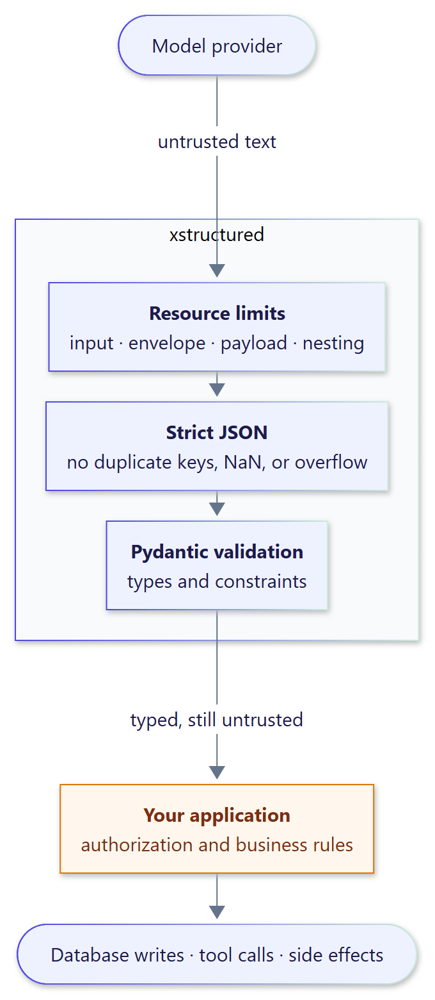

# Security

Model output is untrusted input. `xstructured` bounds, decodes, and validates it; it does
**not** make it safe to act on.

{ .diagram width="340" }

## What xstructured guarantees

- **Bounded work.** Input, envelope, payload, and nesting limits are enforced before or
  during parsing, and scanning is linear-time with no regex backtracking, so oversized or
  adversarial responses fail fast with `LimitExceededError`.
- **Strict JSON.** Duplicate keys, `NaN`, `Infinity`, and numbers that overflow are
  rejected, so two parsers can never disagree about what a payload means.
- **No invented data.** Recovery only selects a substring of the response; it never
  rewrites JSON or completes truncated output.
- **Schema validation.** Every value passes Pydantic v2 validation of your schema.
- **Quiet errors.** Exception messages never include the model output; it is available
  separately as `error.text`.
- **Opt-in model calls only.** Nothing besides your wrapped Runnable is called unless you
  configure a repair Runnable, and oversized responses are never sent to it.

## What remains your responsibility

- **Authorization and business rules.** A schema-valid value can still request something
  the user may not do. Check permissions and invariants before writing to a database,
  calling a tool, or sending a request.
- **Output encoding.** The parser does not sanitize HTML, SQL, shell arguments, URLs, or
  file paths. Use parameterized queries and context-aware encoding.
- **Prompt injection.** Text that reaches the model, including retrieved documents, can
  steer what it produces. Validation constrains the shape of the answer, not its intent.
- **Schema strictness.** Prefer bounded strings and collections, enums or `Literal` for
  closed sets, and `extra="forbid"` where unknown fields indicate a problem.
- **Secrets.** Keep credentials out of prompts, schemas, fixtures, and logs. Avoid
  logging `error.text` or `result.raw_text` where model output may contain personal data.

## Reporting a vulnerability

Please report vulnerabilities privately as described in the repository's
[security policy](https://github.com/smuniharish/xstructured/blob/master/SECURITY.md).
